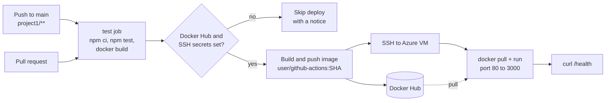

# End-to-End CI/CD Deployment Using GitHub Actions, Docker Hub & Azure VM

<!-- cspell:words azureuser buildx dckr dearmor Dockerized dpkg HEALTHCHECK keyrings nics pushimg sivakumarmahan usermod vnet -->

This guide documents **the complete process of deploying a Dockerized application** to an **Azure Ubuntu VM** using **GitHub Actions** and **Docker Hub**.

Once configured, each code push to `project1/` on the main branch will:

- Install dependencies and run the tests
- Package the app into a Docker image
- Push the image to Docker Hub (tag = commit SHA, plus `latest`)
- Deploy the container to your Azure VM via SSH and check `/health`

Pull requests run only the test and image build. Nothing is pushed or deployed.

Follow these steps to reproduce the setup anytime.

---

## Architecture



---

## Prerequisites

1. **Azure Subscription** – To create the virtual machine (VM) and network.
2. **GitHub Account** – For storing source code and configuring GitHub Actions.
3. **Docker Hub Account** – For container image registry.
4. **SSH Key Pair** – For secure access between GitHub Actions and your VM.

---

## Repository Structure

```text
github-actions/
├── .github/
│   └── workflows/
│       └── ci-cd.yml          # CI/CD workflow for project1
└── project1/
    ├── Dockerfile             # multi-stage, non-root, health check
    ├── .dockerignore
    ├── package.json
    ├── package-lock.json
    ├── src/
    │   └── index.js           # Sample Node.js app (/ and /health)
    ├── test/
    │   └── app.test.js        # node:test smoke test
    └── README.md
```

---

## Step 1: Create Docker Hub Account

1. Go to [https://hub.docker.com](https://hub.docker.com)
2. Create a free account
3. Create a new **Access Token** under
   **Account Settings → Security → New Access Token**

### Example

| Field | Value |
| ------- | -------- |
| **Access token description** | `github-actions` |
| **Access permissions** | Read & Write (the workflow pushes images) |

A read-only token cannot push, so the "Build and push" step would fail with it.
Save the generated token safely (used later in GitHub Secrets).

---

## Step 2: Generate SSH Keys

Run the following command on your **local system** to create a dedicated key pair for GitHub Actions deployment:

```bash
ssh-keygen -t ed25519 -C "github-actions-deploy" -f ~/.ssh/github_actions_deploy
```

This creates:

- `~/.ssh/github_actions_deploy` → Private Key
- `~/.ssh/github_actions_deploy.pub` → Public Key

(RSA 4096 also works: `ssh-keygen -t rsa -b 4096 ...`.)

## Step 3: Create Azure Resources

Create VNet, Subnet, NSG, Public IP, NIC and VM.

```bash
az network vnet create \
  --resource-group test-rg \
  --name testVNet \
  --address-prefix 10.0.0.0/16 \
  --subnet-name testSubnet \
  --subnet-prefix 10.0.1.0/24
```

```bash
az network nsg create \
  --resource-group test-rg \
  --name testNSG
```

SSH must be reachable from GitHub-hosted runners, whose IPs change. If you can, limit
`--source-address-prefixes` to your own IP and use a self-hosted runner or Azure Bastion instead.

```bash
az network nsg rule create \
  --resource-group test-rg \
  --nsg-name testNSG \
  --name allow-ssh \
  --protocol tcp \
  --priority 1000 \
  --destination-port-range 22 \
  --access allow
```

```bash
az network public-ip create \
  --resource-group test-rg \
  --name testPublicIP \
  --sku Standard \
  --allocation-method Static
```

```bash
az network nic create \
  --resource-group test-rg \
  --name testNIC \
  --vnet-name testVNet \
  --subnet testSubnet \
  --network-security-group testNSG \
  --public-ip-address testPublicIP
```

```bash
az vm create \
  --resource-group test-rg \
  --name testUbuntuVM \
  --nics testNIC \
  --image Ubuntu2204 \
  --admin-username azureuser \
  --generate-ssh-keys \
  --size Standard_B2s
```

Add the GitHub Actions public key to the VM:

```bash
az vm user update \
  --resource-group test-rg \
  --name testUbuntuVM \
  --username azureuser \
  --ssh-key-value ~/.ssh/github_actions_deploy.pub
```

## Step 4: Test SSH Access

```bash
VM_IP=$(az network public-ip show -g test-rg -n testPublicIP --query ipAddress -o tsv)
ssh -i ~/.ssh/github_actions_deploy azureuser@"$VM_IP"
```

## Step 5: Fix Docker Permission Issue (if any)

```text
permission denied while trying to connect to the Docker daemon socket
```

Run the following fix inside your VM:

```bash
sudo snap remove docker

sudo apt update
sudo apt install -y \
    ca-certificates \
    curl \
    gnupg \
    lsb-release

sudo mkdir -p /etc/apt/keyrings
curl -fsSL https://download.docker.com/linux/ubuntu/gpg | sudo gpg --dearmor -o /etc/apt/keyrings/docker.gpg

echo \
  "deb [arch=$(dpkg --print-architecture) signed-by=/etc/apt/keyrings/docker.gpg] https://download.docker.com/linux/ubuntu \
  $(lsb_release -cs) stable" | sudo tee /etc/apt/sources.list.d/docker.list > /dev/null

sudo apt update
sudo apt install -y docker-ce docker-ce-cli containerd.io docker-buildx-plugin docker-compose-plugin

sudo systemctl enable --now docker
sudo groupadd -f docker
sudo usermod -aG docker azureuser
exit
```

Then reconnect:

```bash
ssh azureuser@"$VM_IP"
docker ps   # should work without sudo
```

## Step 6: Configure GitHub Secrets

In your GitHub repository, go to:
**Settings → Secrets and variables → Actions → New repository secret**

### GitHub Secrets Configuration

| Secret Name | Description | Example |
| -------------- | -------------- | ---------- |
| **DOCKERHUB_USERNAME** | Your Docker Hub username | `sivakumarmahan` |
| **DOCKERHUB_TOKEN** | Docker Hub access token (Read & Write) | `dckr_pat_xxxxxxxx` |
| **SERVER_HOST** | Public IP of your Azure VM | `20.0.0.10` |
| **SERVER_USER** | SSH username used to connect to VM | `azureuser` |
| **SSH_PRIVATE_KEY** | Contents of your private SSH key file (`~/.ssh/github_actions_deploy`) | *(Paste full key content here)* |

If `DOCKERHUB_TOKEN` or `SSH_PRIVATE_KEY` is missing, the workflow still runs the tests and skips the deploy
with a notice instead of failing.

## Step 7: Allow HTTP Access in NSG

```bash
az network nsg rule create \
  --resource-group test-rg \
  --nsg-name testNSG \
  --name allow-http \
  --protocol tcp \
  --priority 1010 \
  --destination-port-range 80 \
  --access allow
```

## Step 8: Test the Deployment

After your GitHub Actions workflow runs successfully, check the VM:

```text
azureuser@testUbuntuVM:~$ docker ps
CONTAINER ID   IMAGE                                        COMMAND                 STATUS                   PORTS                  NAMES
5505bed72562   sivakumarmahan/github-actions:<commit-sha>   "docker-entrypoint.s…"  Up 1 minute (healthy)    0.0.0.0:80->3000/tcp   github-actions

azureuser@testUbuntuVM:~$ curl http://localhost
Hello from GitHub Actions CI/CD!

azureuser@testUbuntuVM:~$ curl http://localhost/health
{"status":"ok"}
```

Now, open your browser and visit `http://<VM_PUBLIC_IP>`. You will get "Hello from GitHub Actions CI/CD!".

---

## Run it locally

```bash
cd project1
npm ci
npm test
PORT=8080 npm start            # then: curl localhost:8080/health

docker build -t github-actions:local .
docker run --rm -d --name gha-local -p 8080:3000 github-actions:local
curl -s localhost:8080/health
docker rm -f gha-local
```

## Clean up

```bash
az group delete --name test-rg --yes --no-wait
```

Also delete the Docker Hub access token and the GitHub secrets when you no longer need them.

## Troubleshooting

| Symptom | Fix |
| --- | --- |
| `denied: requested access to the resource is denied` on push | The Docker Hub token is read-only. Create a Read & Write token. |
| `ssh: handshake failed` / timeout | NSG rule for port 22 missing, wrong `SERVER_USER`, or the public key is not on the VM. |
| `permission denied ... docker.sock` | Run Step 5, then log out and back in. |
| Deploy step fails at "Health check failed" | The container did not start. The step prints `docker logs`. Check port 80 is free on the VM. |
| Workflow did not run | It only runs for changes under `project1/` or to `ci-cd.yml`. Use **Run workflow** to start it by hand. |

## Tested

Run locally (Node 20, Docker, actionlint 1.7.12, Trivy 0.74.0):

- `npm ci` and `npm test`: 1 test passed. `npm audit`: 0 vulnerabilities (after `npm audit fix`, express 4.22.3).
- `node src/index.js` with `PORT=18090`: `/` and `/health` return 200, clean exit on SIGTERM.
- `docker build` and `docker run`: container runs as user `node`, Docker health status `healthy`, `docker stop` exits at once.
- `trivy image --severity HIGH,CRITICAL --ignore-unfixed`: 0 findings. Before the multi-stage change there were
  7 HIGH findings, all in packages bundled with npm in the base image.
- `actionlint` on `ci-cd.yml`: 0 errors.

Not tested: the push to Docker Hub and the SSH deploy (need the real secrets and the Azure VM).

## Interview talking points

- **Immutable deploys.** The workflow pushes `:<commit-sha>` and deploys that tag, not `latest`.
  Re-running an old workflow redeploys the old build, which is a simple rollback.
- **Path filters per project.** The workflow runs only for `project1/` changes, so a Bicep change in
  `project2/` does not rebuild and redeploy this app.
- **Fail safe without secrets.** A small gate job checks for the secrets and skips the deploy with a notice.
  Forks and new clones stay green.
- **Smaller attack surface.** Multi-stage build, no npm in the runtime image (it carried all the HIGH CVEs),
  non-root user, `HEALTHCHECK`, and an exec-form `CMD` that runs `node` directly, so SIGTERM reaches the app
  and `docker stop` is graceful.
- **Trade-off: push-based SSH deploy.** It is simple but needs port 22 open to GitHub runners and a
  long-lived SSH key in GitHub. Project 2 shows the alternative without stored keys: OIDC to Azure.
