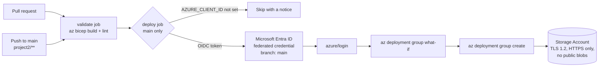

# Project 2: Deploy Bicep to Azure with GitHub Actions and OIDC

<!-- cspell:words AADSTS aimsplus storagegithubaction whatif -->

## Goal

Deploy an Azure Storage Account from `main.bicep` with GitHub Actions.
GitHub logs in to Azure with **OpenID Connect (OIDC)** and a federated credential, so no client secret is stored.

- Pull requests: `bicep build` and `bicep lint` only (no Azure login).
- Push to `main` (changes under `project2/`): validate, `what-if`, then deploy.

## Architecture



## Files

| File | What it is |
| --- | --- |
| `main.bicep` | Storage Account. Parameters: `storageAccountName`, `location` (defaults to the resource group region), `tags`. |
| `../.github/workflows/deploy-bicep.yml` | Validate on PRs, what-if and deploy on `main`. |

## Prerequisites

- An Azure subscription and a resource group (the workflow defaults to `aimsplus`).
- Azure CLI (`az`) with rights to create app registrations and role assignments.
- A storage account name that is free globally (3-24 lowercase letters and numbers).

## Setup steps

1. Create an App Registration in Microsoft Entra ID (Azure AD):

   ```bash
   az ad app create --display-name "github-bicep-deployer"
   ```

2. When you create an App Registration (for GitHub Actions OIDC or SP-based auth), Azure does not
   automatically create a service principal. Create the missing service principal:

   ```bash
   az ad sp create --id <appId>
   ```

3. Assign Contributor access to your resource group (the same group the workflow deploys to):

   ```bash
   az role assignment create \
     --assignee "<appId>" \
     --role "Contributor" \
     --scope "/subscriptions/<subscription-id>/resourceGroups/<resource-group>"
   ```

4. Add a Federated Credential between GitHub and the app.
   Under **Azure Portal → App Registrations → Certificates & secrets → Federated credentials**, configure it as:

   - Federated credential scenario: GitHub Actions deploying Azure resources
   - Organization: `<your GitHub org or username>`
   - Repository: `<repo name>`
   - Entity type: Branch
   - Branch: `main`
   - Name: `github-actions`

   The CLI equivalent:

   ```bash
   az ad app federated-credential create --id <appId> --parameters '{
     "name": "github-actions",
     "issuer": "https://token.actions.githubusercontent.com",
     "subject": "repo:<owner>/<repo>:ref:refs/heads/main",
     "audiences": ["api://AzureADTokenExchange"]
   }'
   ```

5. In GitHub → **Settings → Secrets and variables → Actions**, add these secrets:

   - `AZURE_CLIENT_ID`
   - `AZURE_TENANT_ID`
   - `AZURE_SUBSCRIPTION_ID`

   Optional repository **variable**: `AZURE_RESOURCE_GROUP` (default `aimsplus`).

## Usage

Push a change under `project2/` to `main`, or run **Actions → Deploy Bicep Template (project2) → Run workflow**.

To deploy by hand:

```bash
az deployment group what-if  --resource-group <resource-group> --template-file project2/main.bicep
az deployment group create   --resource-group <resource-group> --template-file project2/main.bicep \
  --parameters storageAccountName=<unique-name>
```

## How to verify

```bash
az storage account show -g <resource-group> -n storagegithubaction \
  --query "{tls:minimumTlsVersion, httpsOnly:enableHttpsTrafficOnly, publicBlob:allowBlobPublicAccess}"
```

Expected: `TLS1_2`, `true`, `false`.

## Clean up

```bash
az storage account delete -g <resource-group> -n storagegithubaction --yes
```

## Troubleshooting

| Symptom | Fix |
| --- | --- |
| `AADSTS70021: No matching federated identity record found` | The federated credential subject must be `repo:<owner>/<repo>:ref:refs/heads/main`. Do not add `environment:` to the deploy job unless you add a matching credential. |
| `AuthorizationFailed` | The service principal needs Contributor on the resource group the workflow uses. |
| `StorageAccountAlreadyTaken` | Storage names are global. Pass another `storageAccountName`. |
| Deploy job skipped with a notice | `AZURE_CLIENT_ID` secret is not set. |

## Tested

- `bicep build main.bicep` (Bicep CLI 0.47.16): builds without errors.
- `bicep lint main.bicep`: no warnings.
- `actionlint` on `deploy-bicep.yml`: 0 errors.

Not tested: `what-if` and the real deployment (need an Azure subscription and the OIDC app registration).

## Interview talking points

- **OIDC instead of a client secret.** The federated credential trusts one repo and one branch.
  There is no secret to rotate or leak; GitHub gets a short-lived token per run.
- **Least privilege per job.** `id-token: write` is only on the deploy job. The validate job runs on PRs
  without any Azure access.
- **What-if before create.** The log shows exactly what will change before the deployment runs.
- **Parameters, not hardcoded values.** Location follows the resource group, and the name is a parameter,
  so the same template works in other subscriptions.
- **Trade-off:** Contributor on the resource group is broad. A custom role limited to
  `Microsoft.Storage/*` and deployments would be tighter.
