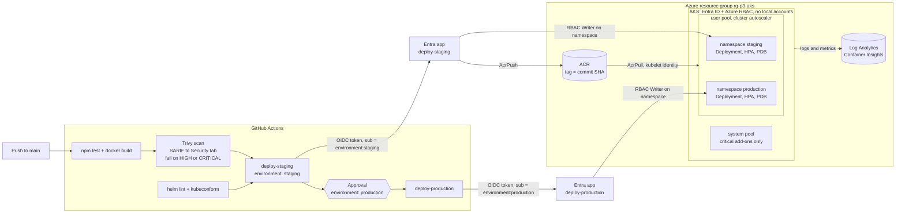
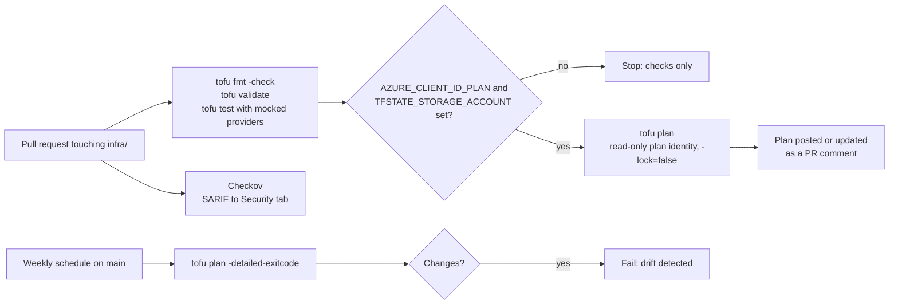

# Project 3: AKS deploy with Helm, GitHub Actions, OIDC and OpenTofu

<!-- cspell:words AADSTS acrp aksexample azuread eastus exitcode kubeconfig kubelet kusto rollouts Kumar kubeconform kubelogin Mahan MSCI nodeimage oidc PolicyInsights SARIF shellcheck sttfstate sttfstateexample tfstate tftest tfvars -->

## Goal

Ship a small Node.js container to **Azure Kubernetes Service (AKS)** with a **Helm** chart, with:

- one build, scanned by **Trivy**, and the same image promoted from staging to production;
- **GitHub OIDC** (Entra ID workload identity federation), so no Azure secret is stored in GitHub;
- **GitHub Environments**: staging deploys on its own, production waits for an approval;
- **least privilege**: each GitHub job has its own Entra identity, limited to its own Kubernetes namespace;
- infrastructure in **OpenTofu** (AKS, ACR, Log Analytics, Entra apps), with `fmt`, `validate`, unit tests,
  **Checkov** and a `plan` comment on every pull request, plus a weekly drift check.

The workflows do not fail on a repository without Azure. Until you set the repository variables listed below,
they only build, test, scan and lint.

## Architecture



Pull requests that touch `infra/` run a second workflow:



## Files

| Path | What it is |
| --- | --- |
| `app/` | Tiny Express app with `/` and `/health`. `/health` returns the image version (commit SHA). |
| `app/Dockerfile` | Multi-stage build, Node 24 LTS on Alpine, non-root UID 1000, no npm in the runtime image. |
| `chart/` | Helm chart: Deployment, Service, ServiceAccount, HPA, PDB and a `helm test` smoke test. |
| `chart/values.yaml` | Defaults: probes, requests/limits, restricted security context, rolling update with no downtime. |
| `chart/values-staging.yaml`, `chart/values-production.yaml` | Per-environment size: replicas (HPA min/max), resources, PDB. |
| `scripts/deploy.sh` | `helm upgrade --install --atomic --wait`, then `helm test`; rolls back if the smoke test fails. |
| `infra/versions.tf` | OpenTofu, azurerm 5.x and azuread 3.x versions, partial `azurerm` backend with Entra ID auth. |
| `infra/main.tf` | Resource group, Log Analytics workspace, Azure Container Registry. |
| `infra/aks.tf` | AKS cluster, user node pool, kubelet identity with AcrPull, Container Insights data collection rule. |
| `infra/identity.tf` | Entra apps, service principals and GitHub federated credentials, role assignments, Workload ID for the app. |
| `infra/outputs.tf` | Cluster and registry names, and a `github_variables` map to copy into GitHub. |
| `infra/example.tfvars` | Example inputs. Copy to `live.tfvars`. |
| `infra/backend.example.hcl` | Example backend settings. Copy to `backend.hcl` (git-ignored). |
| `infra/tests/plan.tftest.hcl` | `tofu test` unit tests against mocked azurerm and azuread providers. |
| `infra/.checkov.yaml` | Checkov settings. Every skipped check has a reason. |
| `../.github/workflows/aks-helm-deploy.yml` | Build, test, scan, lint chart, deploy to staging, then production. |
| `../.github/workflows/tofu-plan-azure.yml` | PR checks for `infra/`, Checkov, plan comment, weekly drift check. |

## Prerequisites

- An Azure subscription where you are **Owner** (or Contributor + Role Based Access Control Administrator).
- In Entra ID: rights to create app registrations. To grant the plan identity Microsoft Graph
  `Application.Read.All`, a **Privileged Role Administrator** must apply (or set `grant_plan_graph_read = false`
  and ask an admin to grant it).
- An Entra ID group for cluster admins (its object ID goes into `admin_group_object_ids`).
- Azure CLI, OpenTofu 1.8 or newer (tested with 1.12.2), Helm 3, kubectl, kubelogin, Docker, Node.js 20+.
- Admin rights on the GitHub repository (to create Environments and variables).

## GitHub configuration

No secrets are needed. Azure access uses OIDC, and client, tenant and subscription IDs are not secret.

Set these under **Settings > Secrets and variables > Actions > Variables > Repository variables**:

| Variable | Used by | Value |
| --- | --- | --- |
| `AZURE_TENANT_ID` | both workflows | Entra tenant ID. |
| `AZURE_SUBSCRIPTION_ID` | both workflows | Subscription ID. |
| `AZURE_CLIENT_ID_STAGING` | `aks-helm-deploy.yml` | Client ID of `gh-p3-aks-deploy-staging`. **Turns on** staging deploys. |
| `AZURE_CLIENT_ID_PRODUCTION` | `aks-helm-deploy.yml` | Client ID of `gh-p3-aks-deploy-production`. **Turns on** production deploys. |
| `ACR_NAME` | `aks-helm-deploy.yml` | Registry name, for example `acrp3aksexample`. |
| `AKS_RESOURCE_GROUP`, `AKS_CLUSTER_NAME` | `aks-helm-deploy.yml` | Optional. Defaults: `rg-p3-aks`, `aks-p3-aks`. |
| `AZURE_CLIENT_ID_PLAN` | `tofu-plan-azure.yml` | Client ID of `gh-p3-aks-plan`. **Turns on** the PR plan and the drift check. |
| `TFSTATE_STORAGE_ACCOUNT` | `tofu-plan-azure.yml` | State storage account name. Also needed to turn on the plan. |
| `TFSTATE_RESOURCE_GROUP`, `TFSTATE_CONTAINER` | `tofu-plan-azure.yml` | Optional. Defaults: `rg-tfstate`, `tfstate`. |

Optional **Environment** variable (on `staging` and on `production`): `APP_IDENTITY_CLIENT_ID`, from the
`app_identity_client_ids` output. It turns on Workload ID for the app's service account.

Why the client IDs are repository variables, not Environment variables: a job-level `if:` is evaluated
before the job enters its Environment, so it cannot see Environment variables.

## Usage

### 1. One-time Azure setup (state storage and resource providers)

```bash
az login
az account set --subscription "<subscription-id>"

# Resource providers (the azurerm provider does not register them, see versions.tf).
for ns in Microsoft.ContainerService Microsoft.ContainerRegistry Microsoft.OperationalInsights \
          Microsoft.Insights Microsoft.ManagedIdentity Microsoft.PolicyInsights; do
  az provider register --namespace "$ns"
done

# State storage: Entra ID auth only, no shared keys, versioning on.
SA=sttfstate$RANDOM
az group create --name rg-tfstate --location eastus2
az storage account create --name "$SA" --resource-group rg-tfstate --location eastus2 \
  --sku Standard_ZRS --min-tls-version TLS1_2 \
  --allow-blob-public-access false --allow-shared-key-access false
az storage account blob-service-properties update --account-name "$SA" --enable-versioning true
az role assignment create --assignee "$(az ad signed-in-user show --query id -o tsv)" \
  --role "Storage Blob Data Contributor" \
  --scope "$(az storage account show --name "$SA" --query id -o tsv)"
az storage container create --name tfstate --account-name "$SA" --auth-mode login
```

### 2. Create the infrastructure

```bash
cd project3-aks-helm-deploy/infra
cp backend.example.hcl backend.hcl   # set storage_account_name to $SA
cp example.tfvars live.tfvars        # set acr_name, admin group, tfstate_storage_account_id
tofu init -backend-config=backend.hcl
tofu plan -var-file=live.tfvars -out=tfplan
tofu apply tfplan
tofu output github_variables
```

Commit `live.tfvars`: it holds no secrets, and the PR plan and the drift check use it.

### 3. Create the namespaces (once, as a cluster admin)

The deploy identities can write only inside their namespace, so they cannot create it.

```bash
az aks get-credentials --resource-group rg-p3-aks --name aks-p3-aks
kubelogin convert-kubeconfig -l azurecli
for ns in staging production; do
  kubectl create namespace "$ns"
  kubectl label namespace "$ns" pod-security.kubernetes.io/enforce=restricted
done
```

### 4. Configure GitHub

1. **Settings > Environments**: create `staging` and `production`.
   On `production`, add **Required reviewers** and limit **Deployment branches** to `main`.
2. Add the repository variables. With the GitHub CLI:

   ```bash
   tofu output -json github_variables | jq -r 'to_entries[] | "\(.key) \(.value)"' |
     while read -r name value; do gh variable set "$name" --body "$value"; done
   gh variable set TFSTATE_STORAGE_ACCOUNT --body "$SA"
   ```

3. Run **Actions > AKS Helm Deploy (project3) > Run workflow** on `main`, or push a change under `app/` or `chart/`.

## How to verify

```bash
kubectl -n staging get deploy,pods,hpa,pdb
helm -n staging history p3-aks-app
helm -n staging test p3-aks-app --logs     # {"status":"ok","version":"<commit sha>"}
kubectl -n staging port-forward svc/p3-aks-app 8080:80 &
curl -s localhost:8080/
```

In GitHub: the run page shows staging deployed and production **Waiting** for review. Trivy and Checkov
findings appear under **Security > Code scanning**. A PR that changes `infra/` gets one plan comment.

Container logs in Log Analytics (KQL):

```kusto
ContainerLogV2
| where PodNamespace in ("staging", "production")
| project TimeGenerated, PodNamespace, PodName, LogMessage
| take 50
```

## Run it locally (no Azure)

```bash
cd project3-aks-helm-deploy/app
npm ci && npm test
docker build --build-arg APP_VERSION=local -t p3-aks-app:local .
docker run --rm -d --name p3-local --read-only --cap-drop ALL -p 8080:3000 p3-aks-app:local
curl -s localhost:8080/health
docker rm -f p3-local

cd ../chart
helm lint . --strict -f values-production.yaml --set image.tag=local
helm template p3-aks-app . -f values-production.yaml --set image.tag=local | kubeconform -strict -summary -

cd ../infra
tofu fmt -check -recursive
tofu init -backend=false && tofu validate
tofu test
checkov -d . --config-file .checkov.yaml
```

The chart and `scripts/deploy.sh` also work on [kind](https://kind.sigs.k8s.io/). From the repository root:

```bash
kind create cluster --name p3
kind load docker-image p3-aks-app:local --name p3
kubectl create namespace staging
kubectl label namespace staging pod-security.kubernetes.io/enforce=restricted
project3-aks-helm-deploy/scripts/deploy.sh staging p3-aks-app local
kind delete cluster --name p3
```

## Clean up

```bash
helm -n staging uninstall p3-aks-app
helm -n production uninstall p3-aks-app
cd project3-aks-helm-deploy/infra
tofu destroy -var-file=live.tfvars
```

`prevent_deletion_if_contains_resources` is on, so the resource group is not deleted if something was
created in it by hand. Delete the state storage account (`rg-tfstate`) last, and remove the GitHub
variables to turn the deploy jobs off again.

## Troubleshooting

| Symptom | Likely cause and fix |
| --- | --- |
| `AADSTS700213: No matching federated identity record found` | The token's `sub` does not match. Deploy jobs need `repo:<owner>/<repo>:environment:<env>`. Check `github_repository` in `live.tfvars` and that the job runs in that Environment. A manual plan run must be on `main`. |
| Deploy jobs are skipped | `AZURE_CLIENT_ID_STAGING` is not set at **repository** level, or the run is a pull request or not on `main`. |
| `az acr login` or `docker push` is denied | Only the staging identity has `AcrPush`. New role assignments can take a few minutes to apply. |
| `Forbidden ... cannot list resource "pods"` | Azure RBAC: the identity can only use its own namespace. Check the namespace exists and the role assignment scope ends in `/namespaces/<env>`. |
| `kubelogin` asks for a device code | Run `kubelogin convert-kubeconfig -l azurecli` after `az aks get-credentials`. |
| Pods stay `Pending` | Not enough room on the user pool. The cluster autoscaler adds nodes up to `user_node_pool.max_count`; check `kubectl describe pod`. |
| Pods fail with `ErrImagePull` | Wrong `ACR_NAME`, or the kubelet identity has no `AcrPull`. Run `az aks check-acr --resource-group rg-p3-aks --name aks-p3-aks --acr <acr>.azurecr.io`. |
| `UPGRADE FAILED ... has been rolled back due to atomic being set` | The new pods never became ready. Check probes and logs: `kubectl -n <env> describe pod`, `kubectl -n <env> logs`. |
| Smoke test fails | `/health` reports a different version than the deployed tag. `deploy.sh` already rolled back. |
| Trivy gate fails | A HIGH or CRITICAL CVE with a fix exists. Update the base image or dependency. Do not lower the gate. |
| Plan fails with `AuthorizationFailed` on Graph or the state blob | Set `tfstate_storage_account_id` and `grant_plan_graph_read`, then apply again. |
| Weekly drift check fails | Someone changed Azure by hand, or `main` has unapplied code. Read the plan in the job summary. |

## Tested

What was run on a local machine (Node 20, Docker, OpenTofu 1.12.2, Helm 3.19, kind 0.33.0, actionlint 1.7.12,
Trivy 0.74.0 and Checkov 3.3.22 as Docker images):

| Check | Command | Result |
| --- | --- | --- |
| App unit tests | `npm ci && npm test` | 2 tests passed, `npm audit`: 0 vulnerabilities |
| Container | `docker build`, then `docker run --read-only --cap-drop ALL --security-opt no-new-privileges` | `/` and `/health` return 200, runs as UID 1000, Docker health `healthy`, exit code 0 on SIGTERM |
| Image scan | `trivy image --severity HIGH,CRITICAL --ignore-unfixed --exit-code 1` | 0 findings (also 0 when unfixed CVEs are included), Alpine 3.24.2 |
| Chart lint | `helm lint --strict` with each values file | 0 charts failed |
| Manifests | `helm template ... \| kubeconform -strict` (Kubernetes 1.33 schemas) | staging and production: 6 of 6 valid |
| Deploy on kind | `scripts/deploy.sh` into namespaces with Pod Security `restricted` enforced (Kubernetes 1.37 node) | staging 2 pods, production 3 pods, PDB, HPA, Service; `helm test` passed; no Pod Security warnings |
| Atomic rollback | deploy a tag that does not exist, 40 s timeout | `UPGRADE FAILED ... rolled back`; the old image kept running |
| Smoke test rollback | deploy an image whose `/health` version does not match the tag | `helm test` failed, `deploy.sh` rolled back to the previous revision |
| Graceful stop | `kubectl delete pod` | about 6 s: 5 s `preStop` sleep, then a clean SIGTERM exit |
| Shell | `shellcheck scripts/deploy.sh` | No findings |
| IaC format and validation | `tofu fmt -check -recursive`, `tofu init -backend=false && tofu validate` | Pass (azurerm 5.8.0, azuread 3.10.0) |
| IaC unit tests | `tofu test` (mocked azurerm and azuread) | 7 passed, 0 failed. A test edit that gave the plan identity `Contributor` and a wrong OIDC subject made 2 runs fail, as expected. |
| IaC security scan | `checkov -d infra --config-file infra/.checkov.yaml` | 20 passed, 0 failed (12 checks skipped on purpose, reasons in `.checkov.yaml`) |
| Workflows | `actionlint` with shellcheck | 0 errors |

**Not tested:**

- Nothing was deployed to Azure (needs a subscription). `tofu plan`/`apply` against Azure, the ACR push,
  `az aks get-credentials` with kubelogin, Azure RBAC on namespaces, the Container Insights data collection rule
  and the Graph app role grant were never run for real.
- The GitHub Actions workflows were linted, not run on GitHub. OIDC login, SARIF upload, Environment approvals,
  the PR comment and the drift schedule need the real GitHub runner.
- HPA scaling (kind has no metrics-server), the cluster autoscaler and Workload ID token exchange were not observed.
- Least privilege of the Azure built-in roles was reviewed by hand, not proven with a real deploy.

TODO (Siva): after the first real run, add the workflow run link and a screenshot of the production approval here.

## Interview talking points

- **Build once, promote the same bytes.** The image is built and scanned once and tagged with the commit SHA.
  Only the staging identity can push to ACR. Production deploys the tag that already passed staging and its
  smoke test, and its identity cannot push at all.
- **One identity per job, bound to the GitHub Environment.** There are three Entra apps, not one app with three
  federated credentials. With one app, a pull request token would get deploy rights. Each deploy app trusts only
  `environment:<env>`, so GitHub gives out a production token only after the reviewers approve.
  The plan app is read-only and also trusted for `main`, for the drift check.
- **Kubernetes access through Azure RBAC.** Local accounts are off, and the kubeconfig uses Entra ID via kubelogin.
  Deploy identities get `Azure Kubernetes Service RBAC Writer` scoped to `<cluster>/namespaces/<env>`, so a
  staging token cannot touch production. Trade-off: one cluster with two namespaces is cheaper, but a cluster
  (or subscription) per environment gives a stronger blast-radius boundary.
- **Zero-downtime rollouts at two layers.** Pods: `maxUnavailable: 0`, startup/readiness/liveness probes, a PDB,
  a `preStop` sleep and SIGTERM handling. Nodes: system and user pools with surge upgrades, automatic patch and
  node image upgrades inside maintenance windows, and the cluster autoscaler under the HPA.
  `--atomic` rolls back a rollout that never gets ready; the script also rolls back when the smoke test fails.
- **Shift-left checks with honest exceptions.** Trivy fails the build on fixable HIGH/CRITICAL CVEs, Checkov fails
  the infra PR, and `tofu test` asserts the security-critical settings (OIDC subjects, roles, local accounts off).
  The API server and ACR stay public because GitHub-hosted runners need them. Going private means self-hosted runners
  in the VNet, which is the next step and is written down in `.checkov.yaml`.
