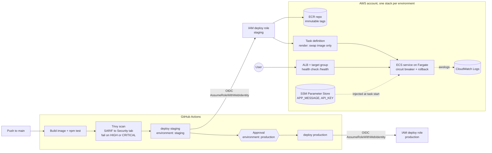
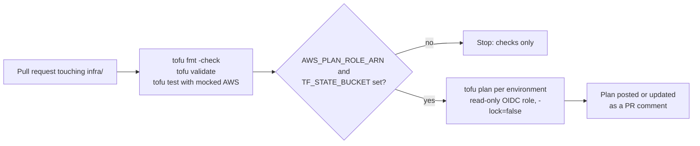

# Project 3: ECS Fargate deploy with GitHub Actions, OIDC and OpenTofu

## Goal

Ship a small Node.js container to **Amazon ECS on Fargate**, behind an **Application Load Balancer**, with:

- one build, scanned by **Trivy**, and the same image promoted from staging to production;
- **GitHub OIDC**, so no AWS access keys are stored in GitHub;
- **GitHub Environments**: staging deploys on its own, production waits for an approval;
- infrastructure in **OpenTofu**, with `fmt`, `validate`, unit tests and a `plan` comment on every pull request.

The workflows do not fail on a repository without AWS. Until you set the repository variables listed below,
they only build, test and scan.

## Architecture



Pull requests that touch `infra/` run a second workflow:



## Files

| Path | What it is |
| --- | --- |
| `app/` | Tiny Express app (same as project1) with `/` and `/health`. Reads `APP_MESSAGE` from SSM. |
| `app/Dockerfile` | Multi-stage build, Node 24 LTS, non-root, no npm in the runtime image, `HEALTHCHECK`. |
| `infra/versions.tf` | OpenTofu and AWS provider versions, partial S3 backend with native locking. |
| `infra/variables.tf` | Inputs, with validation (environment name, at least two ALB subnets). |
| `infra/ecr.tf` | ECR repository: immutable tags, scan on push, keep the last 30 images. |
| `infra/ecs.tf` | Cluster (Container Insights), task definition, Fargate service with circuit breaker. |
| `infra/alb.tf` | ALB, target group (`/health`), HTTP listener, optional HTTPS listener, security groups. |
| `infra/iam.tf` | Execution role, task role, GitHub OIDC provider, deploy role per environment, read-only plan role. |
| `infra/config.tf` | CloudWatch log group and SSM parameters. |
| `infra/outputs.tf` | ALB URL, role ARNs and the values to copy into GitHub. |
| `infra/environments/*.tfvars` | Example values for staging and production. Replace the VPC and subnet IDs. |
| `infra/tests/plan.tftest.hcl` | `tofu test` unit tests against a mocked AWS provider. |
| `../.github/workflows/ecs-fargate-deploy.yml` | Build, test, scan, then call the deploy workflow per environment. |
| `../.github/workflows/ecs-fargate-deploy-env.yml` | Reusable: OIDC login, push to ECR, render task definition, deploy, smoke test. |
| `../.github/workflows/tofu-plan.yml` | PR checks for `infra/` and the plan comment. |

## Prerequisites

- An AWS account, and a VPC with two public subnets (ALB) and two private subnets (tasks).
  Private subnets need a NAT gateway or VPC endpoints for ECR, CloudWatch Logs and SSM.
- An S3 bucket for OpenTofu state (versioning on).
- OpenTofu 1.8 or newer (tested with 1.12.2), AWS CLI v2, Docker, Node.js 20+.
- Admin rights on the GitHub repository (to create Environments and variables).

## Repository variables and secrets

No secrets are needed. AWS access uses OIDC, and the role ARNs are not secret.

Set these under **Settings > Secrets and variables > Actions > Variables**:

| Variable | Level | Used by | Value |
| --- | --- | --- | --- |
| `AWS_DEPLOY_ROLE_ARN_STAGING` | Repository | `ecs-fargate-deploy.yml` | `github_deploy_role_arn` output of the staging stack. **Turns on** staging deploys. |
| `AWS_DEPLOY_ROLE_ARN_PRODUCTION` | Repository | `ecs-fargate-deploy.yml` | `github_deploy_role_arn` output of the production stack. **Turns on** production deploys. |
| `AWS_PLAN_ROLE_ARN` | Repository | `tofu-plan.yml` | `github_plan_role_arn` output (staging stack). **Turns on** PR plans. |
| `TF_STATE_BUCKET` | Repository | `tofu-plan.yml` | Name of the state bucket. |
| `AWS_REGION` | Repository (optional) | both | Defaults to `us-east-1`. |
| `APP_URL` | Environment (optional) | deploy | `alb_url` output. Shows the link on the run page and turns on the smoke test. |
| `ECR_REPOSITORY`, `ECS_CLUSTER`, `ECS_SERVICE`, `TASK_DEFINITION_FAMILY`, `CONTAINER_NAME` | Environment (optional) | deploy | Only if you changed `var.name`. Defaults: `p3-ecs-app-<environment>` and `app`. |

Why the role ARNs are repository variables, not Environment variables: a job-level `if:` is evaluated
before the job enters its Environment, so it cannot see Environment variables.

## Usage

### 1. Create the staging stack

Edit `infra/environments/staging.tfvars` (VPC, subnets, `state_bucket_name`). Then:

```bash
cd project3-ecs-fargate-deploy/infra
tofu init \
  -backend-config="bucket=<your-state-bucket>" \
  -backend-config="key=project3/staging.tfstate" \
  -backend-config="region=us-east-1"
tofu plan -var-file=environments/staging.tfvars -out=tfplan
tofu apply tfplan
tofu output
```

The service starts with the image tag `bootstrap`, which does not exist yet. Tasks fail to start until the
first pipeline run pushes a real image. To avoid that, push a bootstrap image once:

```bash
REPO=$(tofu output -raw ecr_repository_url)
aws ecr get-login-password | docker login --username AWS --password-stdin "${REPO%%/*}"
docker build -t "$REPO:bootstrap" ../app
docker push "$REPO:bootstrap"
```

### 2. Set the real secret value in SSM

OpenTofu creates `API_KEY` with the placeholder `change-me` and then ignores its value:

```bash
aws ssm put-parameter --name /p3-ecs-app/staging/API_KEY \
  --type SecureString --value '<real value>' --overwrite
```

### 3. Configure GitHub

1. **Settings > Environments**: create `staging` and `production`.
   On `production`, add **Required reviewers** and limit **Deployment branches** to `main`.
2. Add the repository variables from the table above.
3. Run **Actions > ECS Fargate Deploy (project3) > Run workflow**, or push a change under `app/`.

### 4. Create the production stack

Same as step 1 with `environments/production.tfvars` and `key=project3/production.tfstate`.
It reuses the OIDC provider created by staging (`create_github_oidc_provider = false`).
Set `AWS_DEPLOY_ROLE_ARN_PRODUCTION` when it is done.

## How to verify

```bash
URL=$(tofu output -raw alb_url)
curl -s "$URL/"          # message from SSM
curl -s "$URL/health"    # {"status":"ok","version":"<commit sha>"}
aws ecs describe-services --cluster p3-ecs-app-staging --services p3-ecs-app-staging \
  --query 'services[0].deployments[*].{status:status,rollout:rolloutState,taskDef:taskDefinition}'
aws logs tail /ecs/p3-ecs-app-staging --follow
```

In GitHub: the run page shows staging deployed, production **Waiting** for review, and Trivy findings
under **Security > Code scanning**. A PR that changes `infra/` gets one plan comment per environment.

## Run it locally (no AWS)

```bash
cd project3-ecs-fargate-deploy/app
npm ci && npm test
docker build --build-arg APP_VERSION=local -t p3-ecs-app:local .
docker run --rm -d --name p3-local --read-only --cap-drop ALL \
  -e APP_MESSAGE="Hello from SSM (simulated)" -p 8080:3000 p3-ecs-app:local
curl -s localhost:8080/health
docker rm -f p3-local

cd ../infra
tofu fmt -check -recursive
tofu init -backend=false && tofu validate
tofu test
```

## Clean up

Production has ALB deletion protection. Turn it off first if you really want to destroy production.

```bash
cd project3-ecs-fargate-deploy/infra
tofu destroy -var-file=environments/staging.tfvars
```

Set `ecr_force_delete = true` (already set for staging) if the ECR repository still has images.
Delete the GitHub variables to turn the deploy jobs off again.

## Troubleshooting

| Symptom | Likely cause and fix |
| --- | --- |
| `Not authorized to perform sts:AssumeRoleWithWebIdentity` | The OIDC `sub` does not match. The deploy role trusts `repo:<owner>/<repo>:environment:<env>`. Check `github_repository` in the tfvars and that the job runs in that Environment. |
| Deploy jobs are skipped | `AWS_DEPLOY_ROLE_ARN_STAGING` is not set at **repository** level, or the run is a pull request. |
| Tasks stop with `CannotPullContainerError` | No image for the tag yet (push the `bootstrap` image), or private subnets have no NAT / VPC endpoints. |
| Tasks stop with `ResourceInitializationError` about SSM | The execution role can read only `/p3-ecs-app/<env>/*` parameters. Check the parameter name. |
| `wait-for-service-stability` times out | Targets fail the `/health` check. Check `aws logs tail` and the target group health. The circuit breaker rolls back. |
| Trivy gate fails | A HIGH or CRITICAL CVE with a fix exists. Update the base image or dependency. Do not lower the gate. |
| `tag invalid: The image tag already exists` | ECR tags are immutable. The push step skips tags that already exist, so re-run the job. |
| Plan comment missing | `AWS_PLAN_ROLE_ARN` / `TF_STATE_BUCKET` not set, or the PR comes from a fork (no OIDC token). |

## Tested

What was run on a local machine (OpenTofu 1.12.2, Docker, Node 20, actionlint 1.7.12, Trivy 0.74.0):

| Check | Command | Result |
| --- | --- | --- |
| App unit test | `npm ci && npm test` | 1 test passed, `npm audit`: 0 vulnerabilities |
| Container | `docker build`, then `docker run --read-only --cap-drop ALL` | `/` and `/health` return 200, Docker health status `healthy`, clean exit on SIGTERM |
| Image scan | `trivy image --severity HIGH,CRITICAL --ignore-unfixed --exit-code 1` | 0 findings (before removing npm from the runtime image: 7 HIGH, all in npm's bundled packages) |
| Formatting | `tofu fmt -check -recursive` | Pass |
| Validation | `tofu init -backend=false && tofu validate` | `Success! The configuration is valid.` |
| Unit tests | `tofu test` (mocked AWS provider) | 4 passed, 0 failed |
| Plan | `tofu plan` against LocalStack 4.4.0 (endpoint override, not committed) | staging: 26 to add; production: 22 to add (reuses the OIDC provider) |
| IAM trust | Targeted `tofu apply` of IAM/SSM/Logs on LocalStack | Deploy role trust has `sub = repo:SivaKumarMahan/github-actions:environment:staging` |
| Workflows | `actionlint` (with shellcheck) | 0 errors |

**Not tested:**

- No deploy to a real AWS account (needs an account and credentials). ECR, ECS and ELBv2 are not in
  LocalStack Community, so they were only planned, never created.
- The GitHub Actions workflows were linted, not run on GitHub. OIDC login, SARIF upload, Environment
  approvals and the PR comment need the real GitHub runner.
- IAM least privilege was reviewed by hand, not proven with IAM Access Analyzer or a real deploy.

## Interview talking points

- **Build once, promote the same bytes.** The image is built and scanned once, saved as an artifact and
  pushed to each environment's ECR repository. Production runs exactly what staging tested. Tags are commit
  SHAs and the repositories are immutable, so a tag can never point to a different image.
- **OIDC with the Environment in the trust policy.** Each deploy role trusts only
  `repo:<owner>/<repo>:environment:<env>`. GitHub issues a production token only after the required reviewers
  approve, so the approval is enforced by AWS IAM, not just by the YAML. No long-lived keys exist to leak.
- **Who owns the task definition.** OpenTofu owns its shape (CPU, memory, roles, logs, SSM secrets).
  The pipeline renders the *latest registered revision* and only swaps the image. The service has
  `ignore_changes = [task_definition]`, so `tofu apply` does not roll back a deploy. Trade-off: tofu state
  does not show the running image; ECS does.
- **Safe rollouts.** Rolling update with 100% minimum healthy, ALB health checks on `/health`, the ECS
  deployment circuit breaker with automatic rollback, and `wait-for-service-stability` so the job fails
  if the rollout fails. The app handles SIGTERM, and the deregistration delay is 30 seconds.
- **Least privilege and safe defaults.** The task role is empty, the execution role reads only this
  environment's log group, ECR repo and SSM parameters, and PassRole is limited to those two roles and
  to `ecs-tasks.amazonaws.com`. PR plans use a separate read-only role with `-lock=false`. Workflows skip
  AWS jobs when the variables are empty, so forks and fresh clones stay green.
